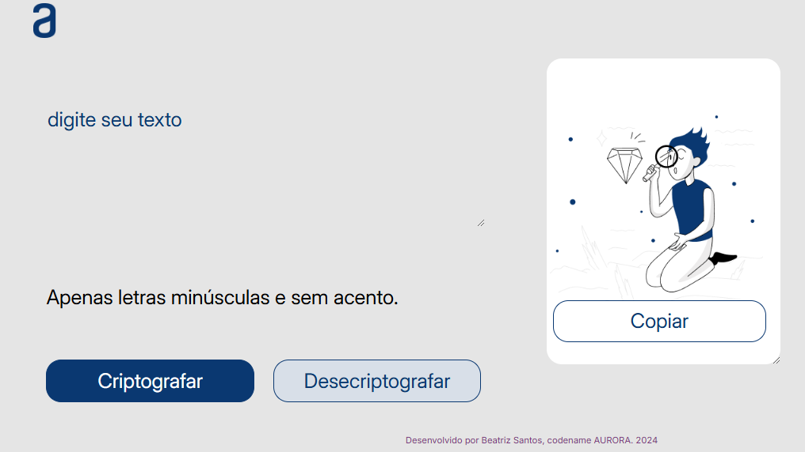

## Desafio Decodificador de Texto: Desvendando a Lógica da Programação

Este repositório contém a minha solução para o Desafio Decodificador de Texto, parte dos desafios da Alura. Através deste projeto, pude aprimorar minhas habilidades em:

Lógica de programação: Desenvolver algoritmos eficientes para manipular strings e realizar as operações de codificação e decodificação.

Resolução de problemas: Analisar o problema, quebrar em partes menores e encontrar soluções criativas.

Pensamento crítico: Avaliar diferentes abordagens e escolher a mais adequada para cada situação.

## Link do projeto 

## Link para o Portfólio

 ## Contato 

 

